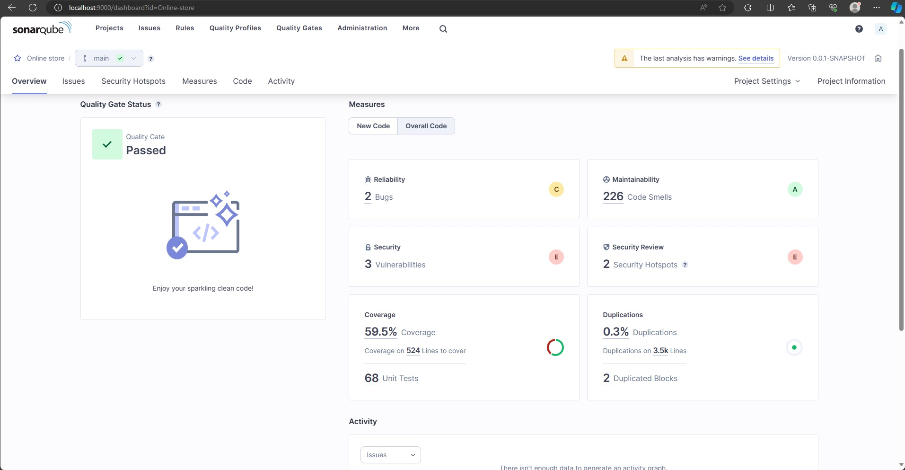

# System Architecture

## 1. High-Level Architecture

The online bookstore application follows a typical three-tier architecture, consisting of a presentation layer, business logic layer, and data storage layer.

### 1.1. Frontend (Presentation Layer)

- Developed using Angular, a robust front-end framework for building dynamic and responsive user interfaces.
- Utilizes TypeScript for enhanced static typing and object-oriented programming support that enhances the development process.
- Responsive and dynamic user interface for seamless user interactions through HTML and CSS, two standard web technologies for structuring and styling web pages.
- The UI components are part of the Angular Material library.

### 1.2. Backend (Business Logic Layer)

- Implemented using Spring Boot with Java, providing a scalable and modular backend architecture.
- Utilizes Java, a widely-used programming language for building scalable and maintainable backend applications.
- Spring Security provides robust authentication and authorization mechanisms.
- JPA and Hibernate work together to handle data persistence tasks.
- QueryDSL simplifies writing database queries.
- JUnit and Mockito were used to write unit tests.

### 1.3. Database (Data Storage Layer)

- PostgreSQL, an open-source relational database system known for its reliability and extensibility, is chosen as the relational database management system (RDBMS).

### 2. Communication Protocols

- RESTful APIs serve as the architectural backbone, providing a standardized and resource-oriented communication channel between the frontend and backend. This paradigm embraces stateless interactions, allowing the frontend to initiate requests and receive responses, creating a coherent and predictable model for information exchange.

### 3. Deployment

A robust deployment strategy is essential for ensuring agility, reliability, and scalability. To achieve this, the system leverages a comprehensive deployment approach, including:

- Docker containers for packaging and deployment to ensure consistency across environments. This ensures seamless deployment across diverse environments, promoting compatibility and reliability.
- Kubernetes orchestrates and manages the deployment, scaling, and operation of application containers. This container orchestration platform introduces an additional layer of automation, facilitating efficient resource utilization, load balancing, and fault tolerance.
- Continuous Integration/Continuous Deployment (CI/CD) pipeline via GitHub Actions and Kubernetes for automated testing and deployment. This not only expedites the delivery of new features and updates but also guarantees the stability of the application through rigorous testing.

### 4. Version Control

Version control is the backbone of collaborative software development, ensuring order, traceability, and collaboration among developers. The Online Bookstore Application relies on GitHub as its central repository hosting service.

### 5. Development Environment

Developers, as architects of the application's codebase, utilize specialized integrated development environments tailored to the technologies employed:

- Feature-Rich Java Development with IntelliJ IDEA, offering an array of features such as intelligent code completion, advanced debugging tools, and a rich ecosystem of plugins. This robust IDE streamlines the development of the server-side components, ensuring code quality and developer productivity.
- Versatile Web Development: Visual Studio Code emerges as the tool of choice for Angular and TypeScript development. Its lightweight yet powerful features, including integrated Git control and debugging support
- PgAdmin 4 serves as the graphical user interface for managing PostgreSQL databases. It enables developers to interact with the database, perform queries, and visualize the database structure. This user-friendly tool enhances the efficiency of database-related tasks, promoting effective collaboration between developers and the database management system.

### 6. Documentation

Documentation serves as the compass that guides developers, stakeholders, and other contributors through development. It encompasses two essential facets: the overarching technical specification document and the detailed API documentation. Both are online and hosted on GitHub.

#### 6.1. Technical Specification Document

- MkDocs is the chosen tool for the creation and upkeep of this technical specification document. Its simplicity and versatility empower developers to structure and organize documentation in a coherent manner.

#### 6.2. API documentation

Javadoc and OpenAPI are used in conjuction to generate an extensive documentation.

##### 6.2.1. Javadoc

- Javadoc is employed to automatically generate API documentation by extracting information from inline comments within the Java source code. This approach ensures that the API documentation remains closely tied to the source code, minimizing the risk of documentation becoming outdated.
- It also generates HTML documentation, making it easily accessible through a designated URL. This user-friendly format allows developers to navigate and comprehend the API specifications effortlessly, fostering a deeper understanding of the codebase.

##### 6.2.2. OpenAPI

- OpenAPIs declarative nature allows for the concise and clear representation of the API structure, endpoints, request-response formats, and authentication mechanisms.
- The integration of OpenAPI provides an interactive API exploration experience, allowing developers and stakeholders to interact with the API documentation dynamically. This functionality enhances understanding and facilitates smoother integration of frontend and backend components.

### 7. Code Quality Analysis

Ensuring the integrity and quality of the codebase is important, therefore SonarQube is being used to ensure that the code quality holds up to certain standards.

- SonarQube, formerly known as Sonar, is seamlessly integrated into the development pipeline, actively scrutinizing the codebase for various dimensions of quality.
- Code analysis covers aspects such as code smells, bugs, security vulnerabilities, and code duplications.

The following patterns were excluded, following the suggestions from the [SonarQube Documentation](https://docs.sonarsource.com/sonarqube/8.9/project-administration/narrowing-the-focus/#patterns), which includes mainly generated code by the Lombok library:

- Folder
  - Security
- Files
  - DTO
  - Entity

This system architecture leverages modern and widely-used technologies to ensure a scalable, maintainable, and secure web application. It encourages separation of concerns and ease of development. Continuous integration, deployment automation, and containerization contribute to a streamlined development and deployment process.

### Future development

Looking ahead, in the future I would like to add the following improvements to the code:

- Testing the frontend with tools like Nightwatch.
- Using cloud services.
